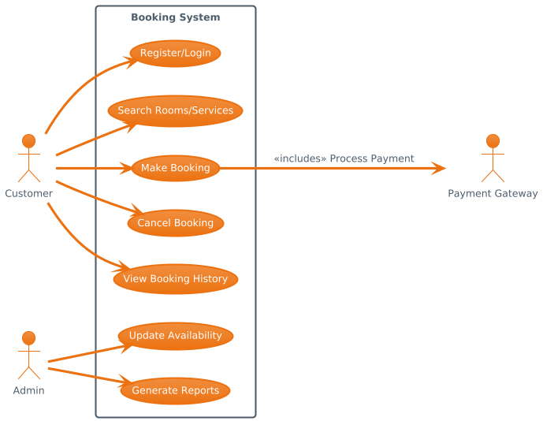

# Requirement Analysis in Software Development.

This repository is dedicated to documenting and understanding the process of requirement analysis in software development. 

## What is Requirement Analysis?

Requirement Analysis is a critical phase in the Software Development Life Cycle (SDLC) where the needs and expectations of stakeholders are identified, analyzed, and documented. It serves as the foundation for all subsequent stages of development, ensuring that the software system aligns with business goals and user demands.

During this phase, business analysts, developers, testers, and stakeholders collaborate to gather functional and non-functional requirements. These are then translated into clear, actionable specifications that guide design, development, and testing.

### Why is Requirement Analysis Important?

- **Clarity and Scope**: It defines what the system should do, helping to establish a clear scope and avoid feature creep.
- **Improved Communication**: Acts as a bridge between stakeholders and the technical team, reducing misunderstandings.
- **Risk Reduction**: Identifies potential risks, inconsistencies, and ambiguities early, minimizing costly revisions later.
- **Better Planning**: Facilitates accurate time, cost, and resource estimation.
- **Quality Assurance**: Ensures that the final product meets user needs and performs as expected.

Skipping or poorly conducting requirement analysis can lead to software that fails to solve the intended problem, exceeds budget, or suffers from delays and rework. Therefore, it is not just a formality—it's a strategic investment in the project's success.

## Key Activities in Requirement Analysis

The process of Requirement Analysis involves several essential activities that ensure the development of a successful software product. Below are the five key activities:

- **Requirement Gathering**  
  This is the initial step where information is collected from stakeholders, users, and subject matter experts. The goal is to understand the needs, goals, and constraints of the system. Techniques include interviews, questionnaires, workshops, and reviewing existing documentation.

- **Requirement Elicitation**  
  Elicitation involves engaging with stakeholders to draw out their actual needs, even if they are not explicitly stated. It requires analytical thinking, active listening, and asking the right questions to uncover hidden or conflicting requirements.

- **Requirement Documentation**  
  Once gathered and elicited, requirements must be documented in a clear, consistent, and structured format. This includes use cases, user stories, Software Requirement Specifications (SRS), and diagrams. Proper documentation ensures that all stakeholders are on the same page.

- **Requirement Analysis and Modeling**  
  This step involves refining and organizing the documented requirements. Analysts identify dependencies, inconsistencies, and priorities, and create models such as data flow diagrams (DFDs), UML diagrams, or wireframes to visualize the system behavior.

- **Requirement Validation**  
  Validation ensures that the documented requirements accurately reflect stakeholder needs and are feasible, complete, and testable. This may involve reviews, walkthroughs, and approval from stakeholders to confirm alignment before moving to design.

Each of these activities contributes to building a solid foundation for the design and development phases, reducing the risk of costly changes later in the project lifecycle.

## Types of Requirements

In software development, requirements are generally categorized into two main types: Functional and Non-functional. Both are essential for delivering a successful system that meets user expectations and business goals.

### Functional Requirements

Functional requirements define what the system should do — the specific behaviors, features, and functions it must support to satisfy user needs.

#### Definition:
These requirements describe **system behaviors or functions** under specific conditions. They outline what the system should do in response to user interactions.

#### Examples (Booking Management Project):
- Users must be able to create, view, modify, and cancel bookings.
- Admins can manage room or service availability and update pricing.
- The system should send a confirmation email upon successful booking.
- Customers can search available services or rooms based on date and location.
- Login and registration features must support user authentication.

### Non-functional Requirements

Non-functional requirements define **how** the system performs certain operations rather than what it does. These are the quality attributes of the system.

#### Definition:
These describe system attributes such as **performance, usability, reliability, scalability, and security**.

#### Examples (Booking Management Project):
- The system must respond to user actions within 2 seconds.
- The platform should support up to 1,000 concurrent users without performance degradation.
- The application should be accessible on both desktop and mobile devices.
- All user data must be encrypted in transit and at rest.
- System uptime must be at least 99.9% per month.

Understanding and properly distinguishing between these two types of requirements ensures comprehensive coverage during analysis, development, and testing.

## Use Case Diagrams

Use Case Diagrams are visual representations of the interactions between users (actors) and the system to achieve specific goals. They are an essential part of requirement analysis because they:

- Provide a clear picture of system functionality from a user perspective.
- Help identify and validate system boundaries.
- Simplify communication between technical and non-technical stakeholders.

Below is a sample use case diagram for the Booking Management System. It highlights the core functionalities and actors involved.

